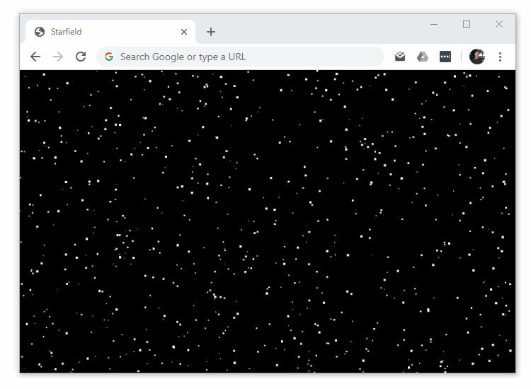

# Starfield

Starfield is a JavsScript class that displays an animated starfield in a `div` element.

Live Example: https://dwmkerr.github.io/starfield/

[](https://dwmkerr.github.io/starfield/)


## Quickstart

Create a HTML `div` initialize a `Starfield` like this:

```js
var container = document.getElementById('container');
var starfield = new Starfield();
starfield.initialise(container);
starfield.start();
```

## Full-Code Example

_Ensure starfield.js file is in the same directory as the HTML file._

```html
<!DOCTYPE html>
<html>
    <head>
        <title>Starfield</title>
        <style>
            #container {
                width: 100%;
                height: 100%;
                position: absolute;
                left: 0px;
                top: 0px;
                z-index: -1;
            }
        </style>
    </head>
    <body>
        <!-- The main starfield container, fills the entire screen. -->
        <div id="container"></div>
        <script src="starfield.js"></script>
        <script>
            //  Get the container and turn it into a starfield.
            var container = document.getElementById('container');
            var starfield = new Starfield();
            starfield.initialise(container);
            starfield.start();
        </script>
    </body>
</html>
```

## Configuration

You can configure the Starfield by setting the following properties on the class:

```js
var starfield = new Starfield();
starfield.stars = 200;      //  The number of stars.
starfield.minVelocity = 5;  //  The minimum star velocity in pixels per second.
starfield.maxVelocity = 15; //  The maximum star velocity in pixels per second.	
```

## Learning More

This code was created for **[Create a Starfield](codeproject.com/Articles/642499/Learn-JavaScript-Part-1-Create-a-Starfield)**, the first article of my _Learn JavaScript_ series on CodeProject.


